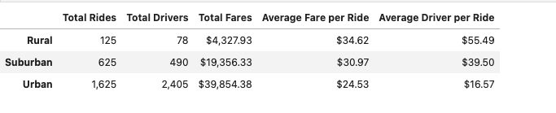
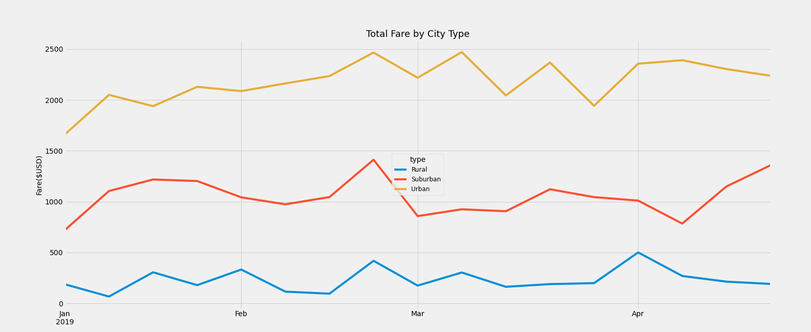

# Ride Sharing Analysis

# Resources
--------------------------------------------------------
#### - Software: Python 3.8.8, JupyterLab Version 3.0.14

# Overview
--------------------------------------------------------
#### The purpose of this project is to create an analysis of the Pyber ride sharing data to compare the number of rides, number of drivers and total fares for the different city types. This analysis will help us determine which city types are doing well in terms of revenue and which city types need additional resources to do better.

# Results

#### - Rural cities have the highest average fare per ride and driver.
#### - Revenue is more when ride to driver ratio is more as in the case of Urban and Suburban city types
#### - Urban cities have the highest demand for rides and rural cities have the least demand for rides.
#### - Urban cities have 5 times more drivers than suburban cities.
#### - Urban cities have 30 times more drivers and almost 10 times the revenue than rural.

# Summary
#### Based on our analysis we see that rural city type has the highest average fare per ride and the highest average driver per ride. This is because, there are fewer drivers available to cater to the demand for ride service. My business recommendations for Pyber is to increase the number of drivers for the rural and suburban city types. So they can catch up to the revenue generated by the Urban city type.

#### This will have the following effect:
#### - More drivers means more rides they can cater to, thus increasing the revenue.
#### - More drivers means cost per ride will decrease, so rural and suburban people can afford to use Pyber ride service. 
#### - Lower price will encourage rural and suburban city people to use Pyber rides more frequently, thus increasing the rural and suburban city type’s revenue.
